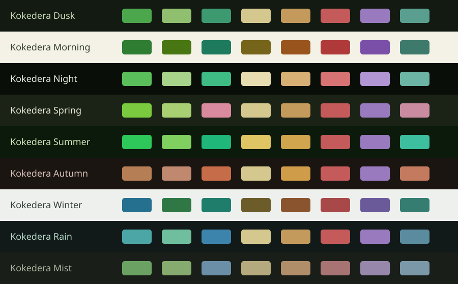

# Kokedera for Obsidian

Nine garden palettes for Obsidian, including Live Preview, reading, callouts, tables and graph colors.

Nine palettes inspired by forest greens, weathered stone, and warm lantern light. Seven dark variants and two light variants, matching the Kokedera themes for VS Code, JetBrains, and Zed.

[Explore Kokedera](https://kokedera.style) · [All ports](https://github.com/cappuccinotogo/kokedera-theme-ports)

## Variants

| Name | Appearance |
| --- | --- |
| Kokedera Dusk | dark |
| Kokedera Morning | light |
| Kokedera Night | dark |
| Kokedera Spring | dark |
| Kokedera Summer | dark |
| Kokedera Autumn | dark |
| Kokedera Winter | light |
| Kokedera Rain | dark |
| Kokedera Mist | dark |

## Installation

1. Copy `manifest.json` and `theme.css` into `<vault>/.obsidian/themes/Kokedera/`.
2. Open **Settings → Appearance → Themes**, select **Kokedera**. Dark mode defaults to Dusk; light mode defaults to Morning.
3. For another variant, copy the matching `snippets/kokedera-<variant>.css` into `<vault>/.obsidian/snippets/`. Set the base color scheme to the variant’s light/dark mode, reload the CSS snippets list, and enable **exactly one** Kokedera snippet. A snippet intentionally only applies in its matching base mode.
4. To return to automatic Dusk/Morning, disable the Kokedera snippets.

No community plugin is required. The theme leaves font choices, note widths and layout under Obsidian’s control. Community plugins that use Obsidian’s public color variables inherit these palettes; plugins with hard-coded colors may require their own styling.

## Consistency and maintenance

This repository contains ready-to-use files generated by [kokedera-theme-ports](https://github.com/cappuccinotogo/kokedera-theme-ports). The same palette snapshot supplies every port; terminal ANSI colors and syntax roles come from the existing VS Code themes. Application-specific UI roles are mapped in the central generators.

To change colors or fix a mapping, edit the central source and regenerate. Avoid hand-editing generated files here. `kokedera.json` records the palette and generator hashes, all nine variants, and file checksums. Run `python scripts/verify.py` to check this checkout.

These are direct-install ports. A GitHub release does not imply approval or inclusion in an application's theme store. See the installation notes for application-specific limits.

## Format references

- https://docs.obsidian.md/Themes/App%20themes/Build%20a%20theme
- https://docs.obsidian.md/Reference/CSS%20variables/About%20styling
- https://help.obsidian.md/snippets

## License

[MIT](LICENSE). Kokedera by Florian Mühlhans.
